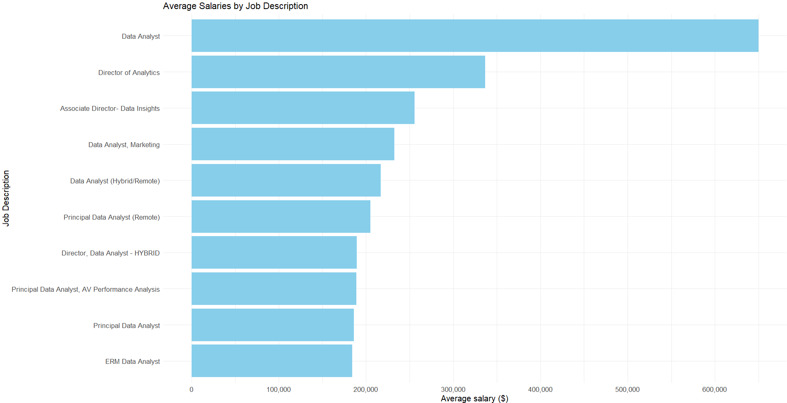
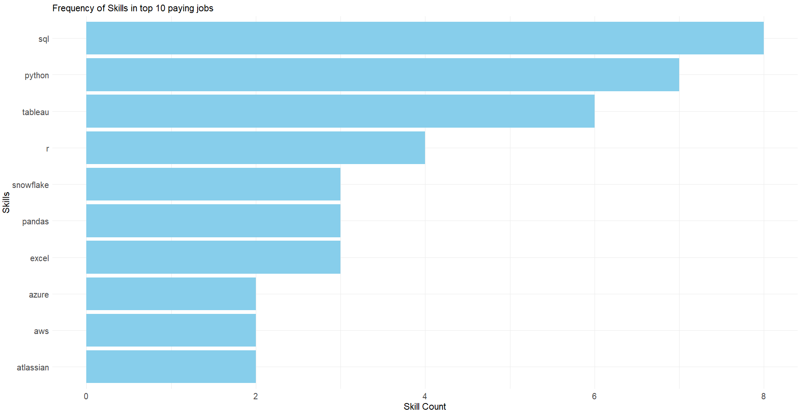

# Introduction
📊 Dive deep into the data job market, with a special focus on data analyst roles! 

In this project, we will explore the landscape of top-paying jobs in the field, identify the most in-demand skills, and analyze where high demand intersects with high salaries. 

📈 This project provides valuable insights into the current trends and opportunities in the data analysis job market. 
Join me as we dive deep into the data to help you navigate your career in this rapidly evolving field!

# Background
This project was created wanting to navigate the data analyst job market to identify top-paying positions and  most sought-after skills, making it easier for others to find the ideal job opportunities.
### The questions we will be answeting are:
1) What are the top-paying data analyst jobs?
2) What skills are required for these top-paying jobs?
3) What skills are most in demand for data analysts?
4) Which skills are associated with higher salaries?
5) What are the most optimal skills to learn?

# Tools I used
🔍In order to perform such analysis I used several tools:
- **SQL**: it allowed me to query the databases and uncover the insights of interest
- **PostgreSQL**: database management system
- **Visual Studio Code**: for database management and executing SQL queries
- **Git and GiyHub**: for version control and sharing my SQL scripts, analysis and outputs

You can access the code here: [sql_code folder](/sql_code/)

# The Analysis
Each query in this project was designed to explore particular aspects of the data analyst job market.  

### 1. Top Paying Data Analyst Jobs
To identify the highest-paying data analyst roles, I filtered data analyst positions by average yearly salary and location, focusing on remote jobs.

Here are some insights: 
- **High Salary Variability by Seniority**: The data reveals significant salary differences, with senior positions like Directors and Principal Data Analysts commanding much higher pay, indicating that experience and leadership roles are major factors in salary determination.
- **Diverse Employers Across Industries**: The wide range of companies, from tech giants like Meta to healthcare organizations like UCLA Health, shows that data analyst roles are in demand across various industries, each offering different compensation levels.
- **Job Title Variability**: The range of job titles, from general "Data Analyst" roles to more specialized positions like "Director of Analytics" or "Principal Data Analyst," underscores the diverse nature of responsibilities within the field, contributing to the salary variations observed.

 
*Bar graph visualizing the salary for the top 10 payed data analysts roles*

### 2. Skills for Top Paying Jobs
To highlight what skills are required for the top paying jobs, I joined the job postings dataset with the skills related data, thus providing information on what is needed for high-compensation positions.

The most in demand skills for the 10 top paying data analyst positions in 2023 are:
- **SQL**: 8 out of the 10 positions require its knowledge
- **Python**: with 7 out of 10 requiring it
- **Tableau**:  is also highly sought after, with a bold count of 6. 
- Other skills like R, Snowflake, Pandas, and Excel are in demand but with a lower degree

 
*Bar graph visualizing the count of skills for the top 10 paying jobs as data analysts*

### 3. In-Demand Skills for Data Analysts
Next, I wanted to identify the most in-demand skills, irrespective of the pay level but directing focusing to areas with high demand.

Here are the most requested skills for a data analyst in 2023:
- **SQL and Excel**: this underlines the need of strong skills in data processing and manipulation
- **Programming and Visualization Tools**: Python, Tableau, and Power BI are essential, this underlines the increasing importance of technical skills and data visualization which are fundamental in decision making.

| **Skills** | **Demand Count** |
|------------|------------------|
| SQL        | 7,291            |
| Excel      | 4,611            |
| Python     | 4,330            |
| Tableau    | 3,745            |
| Power BI   | 2,609            |

*Table of the demand for the top 5 requested skills in data analyst jobs*

### 4. Skills Based on Salary
I then want to explore the average salary linked to the different skills, thus revealing which are the highest paying.

- **High-Paying Skills**: PySpark leads with an average salary of $208,172, showing strong demand for big data expertise. Bitbucket and Couchbase also offer high salaries, emphasizing the importance of version control and NoSQL databases.
- **Emerging Technologies**: DataRobot and Jupyter, with salaries over $150,000, highlight the growing significance of AI and data science. Swift's high salary indicates strong demand in mobile app development.
- **Core Tools**: Pandas and Elasticsearch are essential for data handling, both commanding high salaries, which reflects their critical role in managing and accessing large datasets.

Overall, these specialized skills can lead to significantly higher earnings in the tech industry.

| **Skills**      | **Average Salary ($)** |
|-----------------|------------------------|
| pyspark         | 208,172                |
| bitbucket       | 189,155                |
| couchbase       | 160,515                |
| watson          | 160,515                |
| datarobot       | 155,486                |
| gitlab          | 154,500                |
| swift           | 153,750                |
| jupyter         | 152,777                |
| pandas          | 151,821                |
| elasticsearch   | 145,000                |

*Table of the average salary for the top 10 paying skills required as a data analyst*

### 5. Most Optimal Skills to Learn
The goal now is to highlight skills that are both in high demand and highly paid, providing a strategic focus for targeted skill development.

| Skills     | Demand Count | Average Salary ($) |
|------------|--------------|--------------------|
| Go         | 27           | 115,320            |
| Confluence | 11           | 114,210            |
| Hadoop     | 22           | 113,193            |
| Snowflake  | 37           | 112,948            |
| Azure      | 34           | 111,225            |
| BigQuery   | 13           | 109,654            |
| AWS        | 32           | 108,317            |
| Java       | 17           | 106,906            |
| SSIS       | 12           | 106,683            |
| Jira       | 20           | 104,918            |

*Table of the most optimal skills for a data analyst, sorted by salary*

- **High-Demand Programming Languages**: While Python and R previously stood out for their high demand, their average salaries are around $101,397 for Python and $100,499 for R, indicating that proficiency in these languages is highly valued but also widely available. The table shows that Go and Java are the programming languages listed, with Go having a slightly higher average salary ($115,320) compared to Java ($106,906). Go has a higher demand count (27) compared to Java (17). This suggests that Go is in higher demand and offers better compensation in this dataset.

- **Cloud Tools and Technologies**: Cloud-related skills include Azure, AWS, and Snowflake. Azure has the highest demand count (34) among the cloud tools, with an average salary of $111,225. AWS is also in demand (32) but offers a lower average salary ($108,317). Snowflake, with the highest demand count (37), has the lowest average salary of the three at $112,948. This indicates a robust demand for cloud technologies with slightly varying salary levels.

- **Business Intelligence and Visualization Tools**: The table includes Confluence and BigQuery under this category. Confluence, with a demand count of 11, offers an average salary of $114,210. BigQuery, with a demand count of 13, has a lower average salary of $109,654. This suggests that while both tools are in demand, Confluence commands a higher salary.

- **Database Technologies**: Hadoop and SSIS are listed as database technologies. Hadoop has a higher demand count (22) compared to SSIS (12), and it also has a slightly higher average salary ($113,193) compared to SSIS ($106,683). This indicates that Hadoop is more sought after and offers better compensation than SSIS in this dataset.

# What I learned
In this project, I had the opportunity to practice complex SQL skills by manipulating diverse data sources to provide insightful knowledge on the dataset. From my analysis, I found the following:

- **Complex Query Crafting**: I mastered the art of advanced SQL, seamlessly merging tables and wielding WITH clauses for sophisticated temporary table maneuvers.

- **Data Aggregation**: I became proficient with GROUP BY and turned aggregate functions like COUNT() and AVG() into essential tools for summarizing and analyzing data.

- **Insightful Query Development**: I enhanced my real-world puzzle-solving skills, transforming complex questions into actionable and insightful SQL queries.

# Conclusions
From the analysis, several key insights emerged:

- **Top-Paying Data Analyst Jobs**: Data analyst positions that offer remote work feature a broad salary range, with the highest reaching up to $650,000.

- **Skills for Top-Paying Jobs**: Advanced proficiency in SQL and Python is crucial for securing high-paying data analyst roles, underscoring its importance for maximizing salary potential.

- **Most In-Demand Skills**: SQL is the most sought-after skill in the data analyst job market, making it essential for job seekers aiming to enhance their employability.

- **Skills with Higher Salaries**: Specialized skills like SVN and Solidity are linked to the highest average salaries, highlighting the value of niche expertise in the field.

- **Optimal Skills for Job Market Value**: SQL stands out for its high demand and strong salary potential, making it a key skill for data analysts to learn in order to boost their market value.

